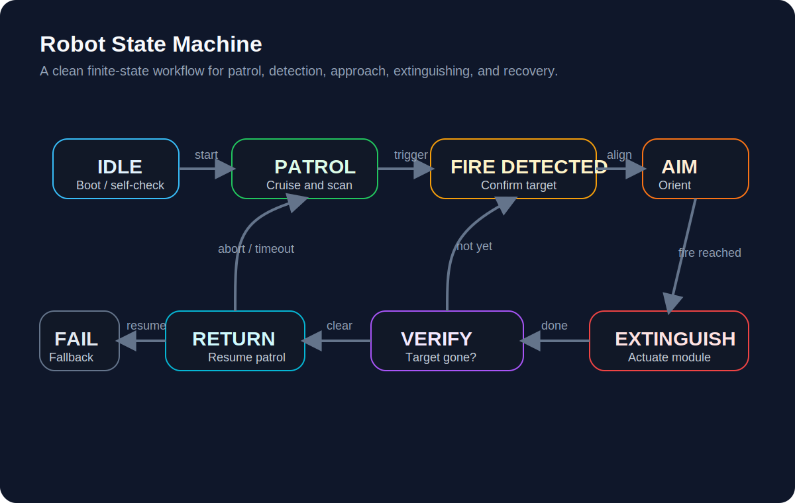
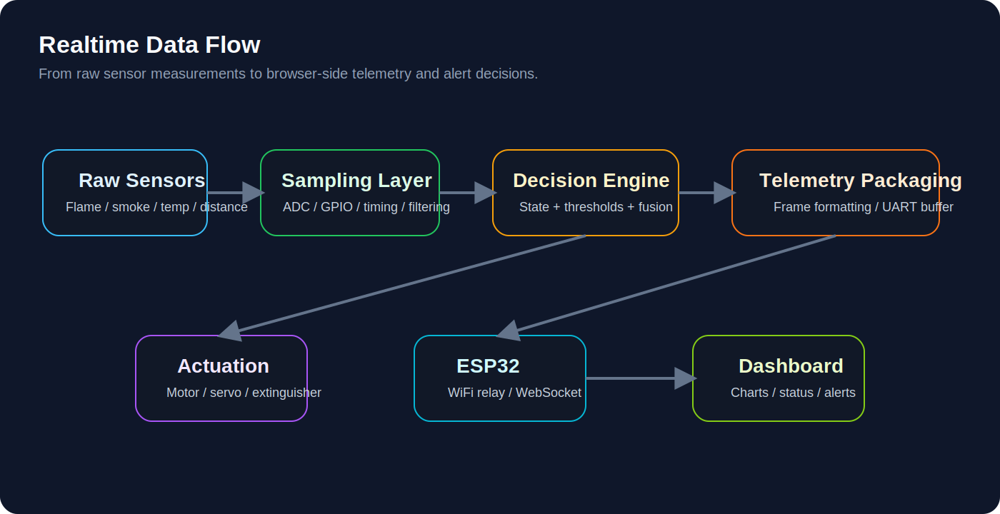

# 🔥 FireNex
## Autonomous Fire Monitoring & Firefighting Robot Platform

<p align="center">
  
</p>

<p align="center">
  Embedded Robotics · Multi-Sensor Perception · Autonomous Navigation · Web Telemetry
</p>

<p align="center">


</p>

---

## 📖 Overview

**FireNex** is an autonomous fire monitoring and firefighting robot platform built around **STM32F103C8T6** and **ESP32 / ESP8266**.

The project combines **multi-sensor fire perception**, **autonomous patrol**, **target approach**, **servo-based extinguishing execution**, and **web-side telemetry visualization** into a complete embedded robotics workflow.

The robot patrols the environment, continuously monitors flame / smoke / temperature-related signals, confirms fire risk through multi-source sensing, moves toward the target, and triggers a **servo-driven flip mechanism** to deploy an **extinguishing ball**. Meanwhile, the ESP32 uploads telemetry data to the web dashboard for real-time monitoring and alert visualization.

**Core pipeline**

```text
Perception → Decision → Patrol → Fire Confirmation → Target Approach → Extinguish → Verify → Feedback
```

---

## ✨ Key Features

### 🔥 Fire Monitoring
- 4-channel flame sensing for directional fire-source perception
- MQ2 smoke detection for combustion-related abnormality sensing
- DHT11 temperature & humidity monitoring
- Multi-sensor confirmation logic to reduce false alarms

### 🤖 Autonomous Patrol
- Automatic patrol in normal state
- Continuous environment scanning during movement
- Obstacle perception using HC-SR04 ultrasonic module
- Encoder-assisted motion feedback for more stable chassis control

### 🎯 Fire Targeting & Approach
- Fire-confirmed state transition based on sensor fusion
- Automatic target approach after detection
- Servo-assisted orientation / actuation preparation before extinguishing

### 🧯 Extinguishing Mechanism
- Servo-driven flip-plate structure
- Fire-extinguishing ball release
- Extinguish → verify → return closed-loop workflow

### 🌐 Web Telemetry & Visualization
- Real-time device monitoring
- Alert statistics and event stream
- Temperature trend chart
- Alarm category distribution
- Area / node status overview

### 🛠️ Local Debug & Tuning
- OLED local display
- Key input for manual interaction / debugging
- UART / BlueSerial debugging channels
- Modular driver structure for incremental development

---

## 🌐 Web Monitoring Dashboard

<p align="center">
  
</p>

The current dashboard page already demonstrates the monitoring side of the project, including:

- daily alarm summary
- online device count
- peak temperature
- smoke index
- temperature trend chart
- alarm distribution chart
- real-time alarm stream
- area status panel

This page can be used as the current project demo interface before the physical robot prototype photos are available.

---

## 🧠 System Architecture

<p align="center">
  
</p>

The system is organized into the following layers:

### 1. Sensor Layer
Used for environmental perception and fire-risk acquisition:

- **Flame sensor array (4 channels)**
- **MQ2 smoke sensor**
- **DHT11 temperature & humidity sensor**
- **HC-SR04 ultrasonic module**
- **MPU6050 IMU**

### 2. Control Layer
Main controller:

- **STM32F103C8T6**

Responsible for:

- sensor acquisition
- threshold comparison
- motion control
- state transitions
- extinguishing logic coordination

### 3. Communication Layer
Wireless telemetry / upper-layer communication:

- **ESP32 / ESP8266**
- UART communication with STM32
- optional Bluetooth / WiFi-side expansion

### 4. Motion Layer
Robot chassis subsystem:

- motor driver
- motor A / motor B
- wheel encoders
- PWM speed control
- PID closed-loop regulation

### 5. Extinguishing Layer
Fire suppression execution subsystem:

- servo actuator
- flip-plate structure
- extinguishing ball release

### 6. Debug & Interaction Layer
For local display and system debugging:

- OLED
- Keys
- Debug UART

---

## 🤖 Robot State Machine

<p align="center">
  
</p>

Recommended control state flow:

1. **IDLE**  
   Power-on, peripheral initialization, sensor warm-up, threshold loading

2. **PATROL**  
   Autonomous patrol, environmental sensing, obstacle checking, motion control

3. **FIRE_DETECTED**  
   Flame / smoke / temperature abnormality confirmation, target locking

4. **AIM**  
   Chassis / servo adjustment for extinguishing preparation

5. **EXTINGUISH**  
   Trigger servo flip mechanism and release extinguishing ball

6. **VERIFY**  
   Re-check whether flame / smoke alarm disappears after extinguishing

7. **RETURN**  
   Return to patrol state or reset to monitoring mode

8. **FAILSAFE**  
   Timeout, actuator failure, abnormal communication, or emergency stop branch

---

## 📊 Realtime Data Flow

<p align="center">
  
</p>

From raw sensor measurements to browser-side telemetry and alert decisions:

```text
Flame / Smoke / Temperature / Distance / IMU
                  ↓
         STM32 acquisition & control
                  ↓
        State machine / decision logic
                  ↓
          UART telemetry to ESP32
                  ↓
          Web dashboard visualization
                  ↓
     Alert presentation / monitoring feedback
```

Typical uploaded telemetry includes:

- flame signal
- smoke value
- temperature / humidity
- obstacle distance
- patrol / fire / extinguish state
- alert level / alert type
- online device status

---

## 🧩 Hardware Components

| Module | Model / Description |
| --- | --- |
| Main MCU | STM32F103C8T6 |
| Wireless Communication | ESP32 / ESP8266 |
| Flame Detection | 4-channel flame sensor |
| Smoke Detection | MQ2 |
| Temperature & Humidity | DHT11 |
| Obstacle Detection | HC-SR04 |
| IMU | MPU6050 |
| Display | OLED |
| Motor Drive | Dual DC motor driver |
| Motion Feedback | Wheel encoders |
| Extinguishing Actuation | Servo |
| Extinguishing Payload | Fire-extinguishing ball |
| Debug / Interaction | Key + UART + BlueSerial |

---

## 💻 Firmware Architecture

The project firmware follows a **driver layer + user layer + application layer** structure.

### Driver / Module Layer

Current low-level or functional modules visible in the project include:

```text
OLED.c / OLED.h
OLED_Data.c / OLED_Data.h
Key.c / Key.h
MPU6050.c / MPU6050.h
MyI2C.c / MyI2C.h
Motor.c / Motor.h
PWM.c / PWM.h
Encoder.c / Encoder.h
Serial.c / Serial.h
BlueSerial.c / BlueSerial.h
Flame.c / Flame.h
Smoke.c / Smoke.h
DHT11.c / DHT11.h
Ultrasonic.c / Ultrasonic.h
Servo.c / Servo.h
USART2.c / USART2.h
ADC.c / ADC.h
```

### User / Control Layer

```text
main.c
stm32f10x_conf / interrupt files
PID.c / PID.h
```

Main responsibilities:

- peripheral startup
- interrupt response
- speed loop / closed-loop control
- scheduling core logic

### Application Layer

```text
app_state_machine.c / .h
app_patrol.c / .h
app_fire.c / .h
app_extinguish.c / .h
```

Suggested responsibility split:

- **app_state_machine**: global control flow and state transition management
- **app_patrol**: patrol behavior, navigation and obstacle logic
- **app_fire**: fire detection, threshold logic, confirmation strategy
- **app_extinguish**: servo action and extinguishing execution sequence

---

## 📂 Repository Structure

```text
FireNex
│
├── firmware
│   ├── drivers
│   ├── user
│   └── app
│
├── docs
│   ├── images
│   │   ├── cover.png
│   │   └── dashboard-overview.png
│   ├── diagrams
│   │   └── system-architecture.png
│   └── pin-mapping.md
│
├── web_dashboard
│
└── README.md
```

---

## 🔧 Pin Mapping

Detailed MCU pin allocation is documented in:

```text
docs/pin-mapping.md
```

This file is intended to include:

- MCU package pin overview
- signal type allocation
- timer-related pins
- communication interfaces
- future reserved pins

---

## 🧪 Current Project Status

At the current stage, the repository can already present:

- system-level project positioning
- web dashboard demo page
- hardware architecture diagram
- firmware module layout
- state-machine-oriented application design
- public pin allocation document

Physical robot photos and complete field-test demo media can be added later without changing the overall repository structure.

---

## 🚀 Roadmap

Planned improvements:

- real physical robot showcase photos
- demo video / GIF of patrol and extinguishing
- optimized fire-source localization logic
- richer dashboard-device linkage
- computer vision based fire confirmation
- multi-robot collaboration
- cloud-side data archive and analytics

---

## 📜 License

MIT License

---

## 👨‍💻 Project Positioning

FireNex is positioned as an **embedded robotics open-source project** focused on:

- fire monitoring
- autonomous mobile execution
- extinguishing mechanism integration
- embedded control + wireless telemetry collaboration

It can serve as:

- an embedded systems course / competition project
- a robotics portfolio project
- a GitHub open-source engineering showcase
- a basis for future AI + robotics expansion
