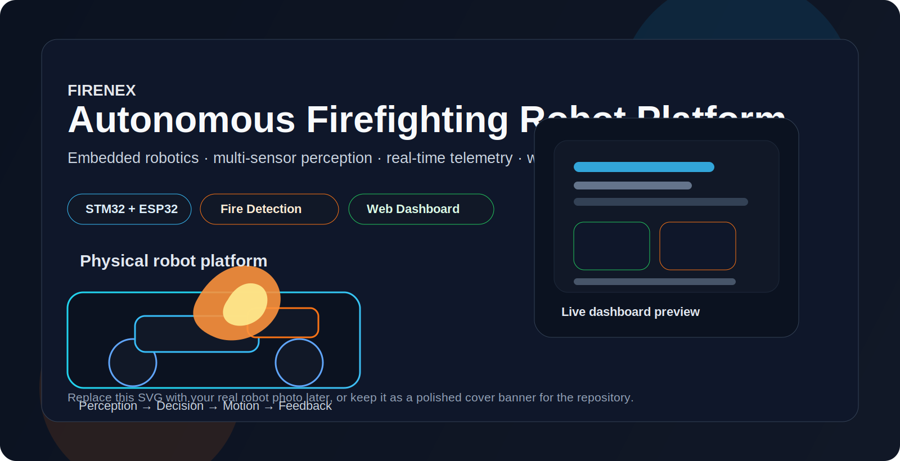
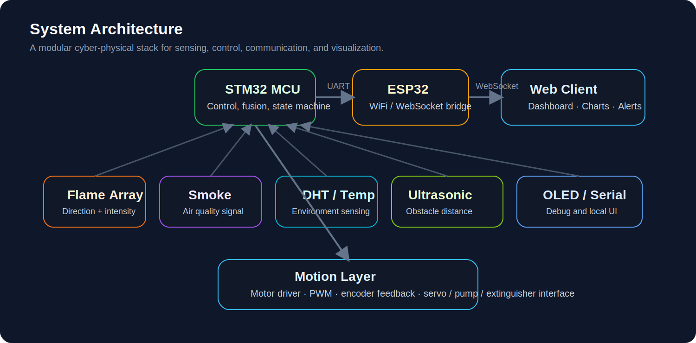

# 🔥 FireNex – Autonomous Firefighting Robot

🚒 Autonomous Fire Detection  
⚡ Multi-Sensor Fusion  
🌐 Real-time Telemetry  
🤖 Embedded Robotics Platform  

---

## 📖 Overview

FireNex is an autonomous firefighting robot platform built with **STM32 and ESP32**.

The system integrates:

- fire detection sensors
- autonomous robot navigation
- wireless telemetry
- web-based monitoring

Pipeline:

Perception → Decision → Motion → Feedback

---

## 🧠 System Architecture

---

## 🤖 Robot State Machine

---

## 📊 Data Flow

---

## ✨ Features

- 🔥 Flame detection
- 🌫 Smoke monitoring
- 🌡 Temperature sensing
- 🚗 Autonomous patrol
- 📡 WiFi telemetry
- 🌐 Web dashboard

---

## 📂 Repository Structure

FireNex
│
├── firmware
├── hardware
├── docs
│ ├── diagrams
│ └── images
└── web_dashboard

---

## 🚀 Getting Started

### Build Firmware

Open project with

STM32CubeIDE

Flash firmware to STM32.

### Run Dashboard

npm install
npm run dev

---

## 📜 License

MIT License
